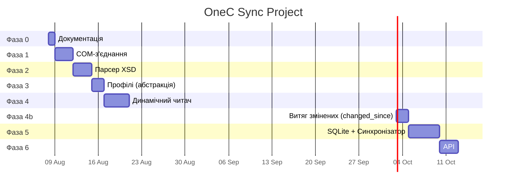

# Gantt-діаграма залежностей

## Таблиця залежностей

| Задача | Залежить від | Критичний шлях |
|---|---|---|
| `task-000-docs` | — | ✅ |
| `task-001-com-connection` | `task-000-docs` | ✅ |
| `task-002-xsd-parser` | `task-001-com-connection` | ✅ |
| `task-003-profiles` | `task-002-xsd-parser` | ✅ |
| `task-004-catalog-reader` | `task-003-profiles` | ✅ |
| `task-004a-performance` | `task-004-catalog-reader` | ✅ |
| `task-004b-changed-since` | `task-004a-performance` | ✅ |
| `task-005-sync-sqlite` | `task-004b-changed-since` | ✅ |
| `task-006-api` | `task-005-sync-sqlite` | ✅ |

**Критичний шлях**: 0 → 1 → 2 → 3 → 4 → 4a → 4b → 5 → 6

## Правила оновлення

- Після зміни задач — оновити цей файл та `index.md`
- Після завершення задачі — оновити статус у `index.md` та Action log у відповідному task-файлі